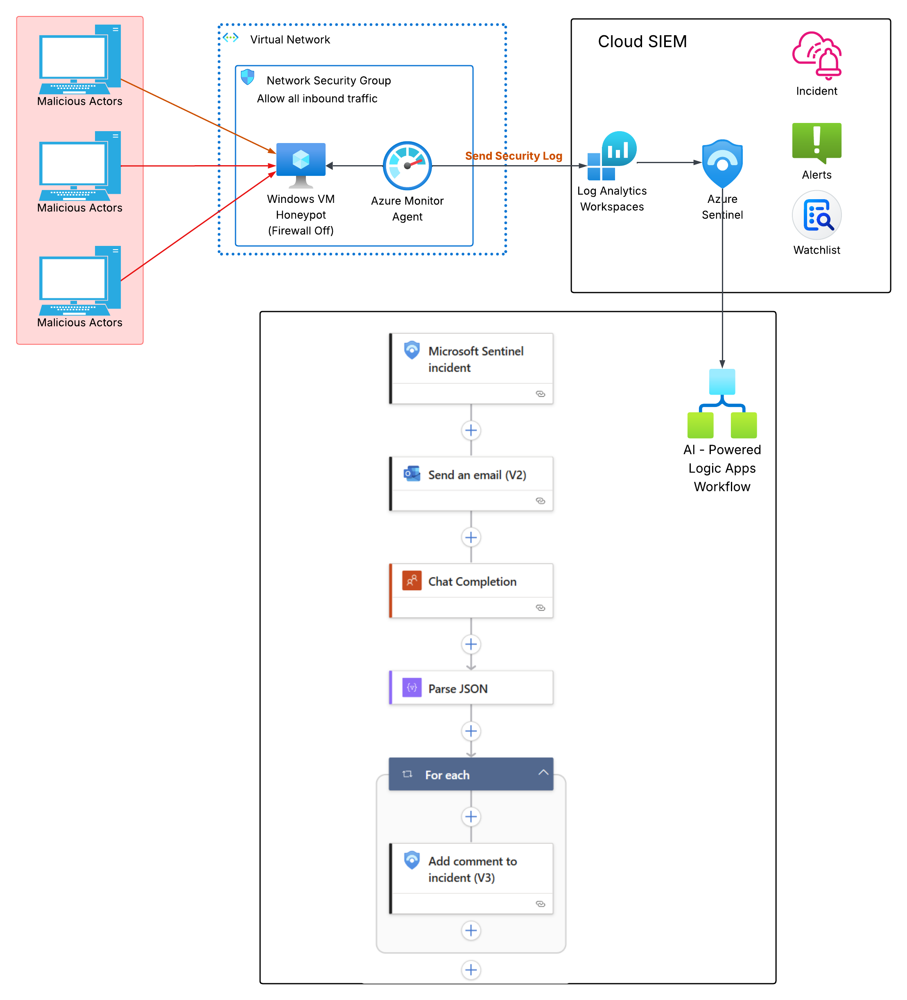
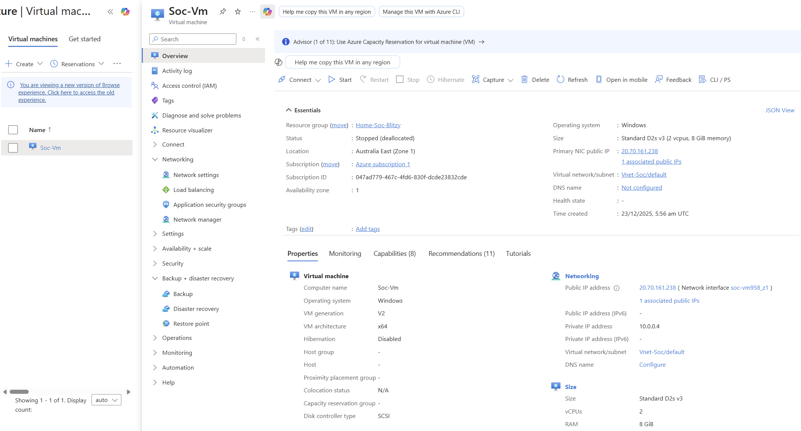
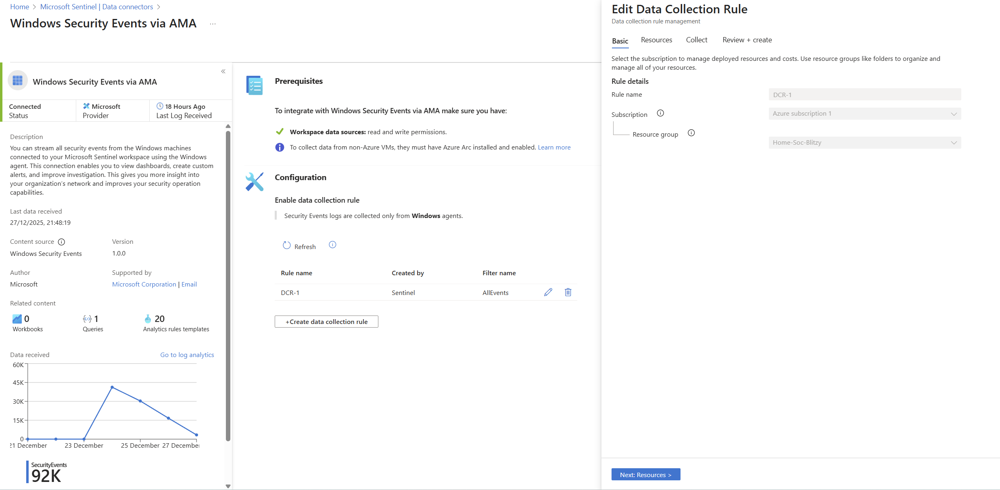
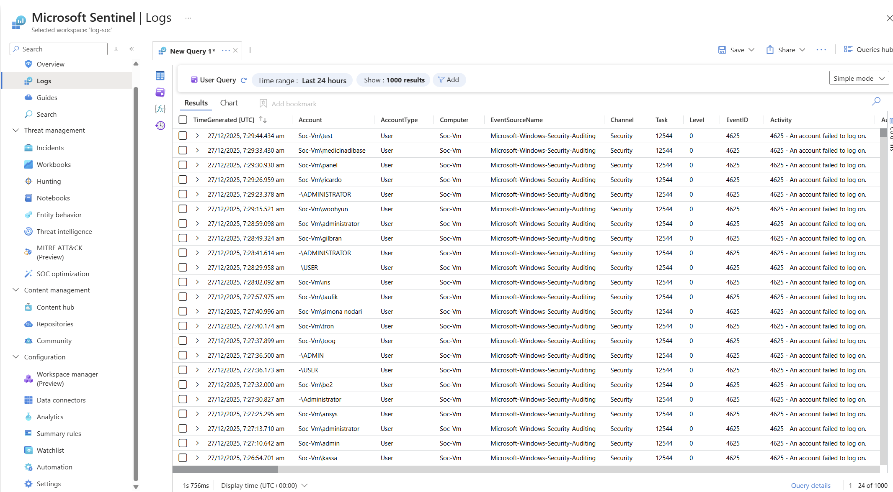
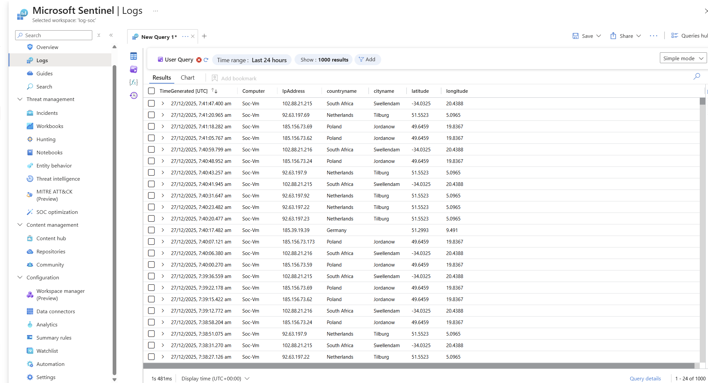
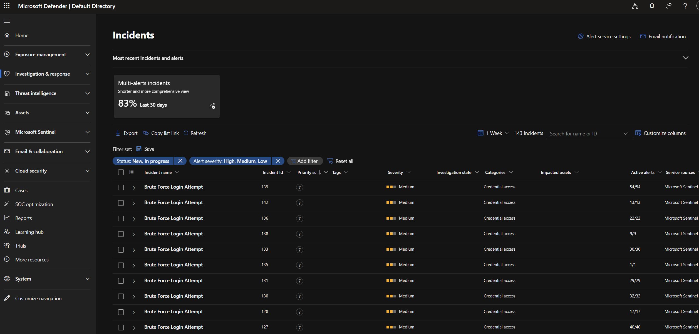
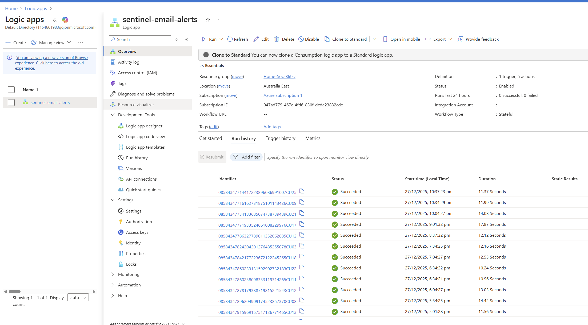
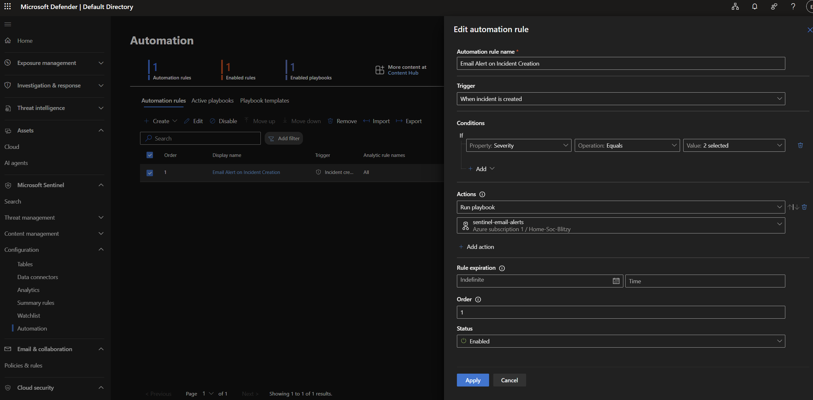

## Overview

This is a complete cloud-based honeypot-SIEM setup that automatically detects real world cyberattacks based on defined alerting rules, maps their geographic origins, analyzes threats using artificial intelligence, and notifies security analysts.

When attackers attempt to brute force my intentionally vulnerable Windows 11 honeypot exposed to the internet, the system is able to:
1. Detects the failed login attempts within an hour
2. Maps the attacker's location (country, city, coordinates)
3. Uses AI (GPT) to assess the threat and recommend actions
4. Creates a security incident with full context
5. Sends an email alert to the hypothetical SOC team

## Architecture 

Made using lucidchart



## Tools Used

**Microsoft Azure** - Cloud platform hosting the entire infrastructure

**Windows 11 VM** - Intentionally vulnerable honeypot with all security controls disabled

**Network Security Group** - Azure firewall configured to allow ALL traffic (honeypot exposure)

**Azure Monitor Agent** - Collects security events from the Windows VM

**Log Analytics Workspace** - Centralized repository for all security logs

**Microsoft Sentinel** - Cloud-native SIEM platform for threat detection and incident management

**Watchlist (IP Geolocation)** - Database mapping IP addresses to geographic locations

**Azure Logic Apps** - Serverless automation platform orchestrating the response workflow

**OpenAI GPT-3.5-Turbo** - AI model providing intelligent threat analysis and recommendations

**Office 365 Outlook** - Email notification system for security alerts

## How It Works

Here's what happens when an attacker tries to brute force the honeypot:

### Step 1: Attack Exposure
- Honeypot VM exposed to internet with all ports open
- Windows Firewall completely disabled
- RDP port (3389) accessible from anywhere
- Attackers discover the vulnerable system through internet scanning

### Step 2: Attack Detection
- Attacker attempts multiple failed RDP logins
- Windows generates Event ID 4625 (Failed Logon)
- Azure Monitor Agent captures the events
- Logs forwarded to Log Analytics Workspace via Data Collection Rule

### Step 3: Geolocation Enrichment
- Sentinel enriches attack data using IP geolocation watchlist
- Attacker IP mapped to country, city, and coordinates
- Attack origin visualized on global map

### Step 4: Automated Threat Detection
- Custom analytic rule runs every hour
- Detects IPs with >5 failed login attempts
- Automatically creates security incident
- Incident includes severity, description, and affected entities

### Step 5: AI-Powered Analysis
- Logic App triggered by new incident
- Sends incident details to GPT-3.5-Turbo API
- AI analyzes threat and generates:
  - Threat assessment
  - Immediate recommended actions
  - MITRE ATT&CK technique mapping
  - Risk score (1-10)

### Step 6: Automated Response
- AI analysis added as comment to Sentinel incident
- Email notification sent to SOC analyst with:
  - Incident details
  - Link to full investigation
  - AI recommendations
- All data centralized in Sentinel for investigation

### Step 7: Investigation
- Analyst reviews enriched incident in Sentinel
- Examines attack patterns and geographic distribution
- Uses KQL queries to investigate scope
- Documents findings and remediation actions

## Real-World Results

After 48 hours of exposure, the honeypot captured:

- **24,288** failed login attempts from Netherlands
- **17,119** failed login attempts from Australia  
- **2,845** failed login attempts from Spain
- Attacks from **15+ countries** including Russia, China, India, Poland, Germany
- **10-15 automated incidents** created per day
- **100% automated** threat analysis and notification
- **Average detection time:** <1 hour from attack to incident creation

## Building This Lab Step by Step

This section walks through how I built this SOC automation lab from scratch. Configuration files and queries are available in the `/config` and `/kql-queries` folders.

### Phase 1: Setting Up Azure Infrastructure

**Creating the Resource Group**

I started by creating a resource group called "Home-Soc-Blitzy" in the Australia East region. This acts as a logical container for all resources in the project, making management and eventual cleanup straightforward.

**Deploying the Virtual Network**

I created a virtual network (Vnet-Soc) to provide network infrastructure for the VM. I used the default Azure settings for the address space and subnets, as this was sufficient for a single-VM honeypot.

**Provisioning the Honeypot VM**

For the honeypot, I deployed a Windows 11 virtual machine with the following specifications:
- **Size:** Standard D2s v3 (2 vCPUs, 8 GB RAM)
- **Public IP:** Static IP assigned for consistent access
- **Image:** Windows 11 Pro

Initially, I faced a quota limitation with DSv5 series VMs, so I switched to D2s v3 which worked within my subscription limits.



### Phase 2: Exposing the Honeypot to Attacks

**Configuring Network Security Group (NSG)**

To attract attackers, I needed to completely expose the VM to the internet. I created an inbound security rule called "AllowEverything" with these settings:
- **Source:** Any
- **Source ports:** *
- **Destination:** Any  
- **Destination ports:** *
- **Protocol:** Any
- **Action:** Allow
- **Priority:** 100

This rule opens ALL ports to ALL traffic—something you would never do in production but essential for honeypot research.

**Disabling Windows Security**

After RDP'ing into the VM, I disabled Windows Defender Firewall for all profiles (Domain, Private, Public). This removed the last layer of protection, ensuring failed login attempts would be logged without being blocked.

⚠️ **Warning:** This VM is intentionally vulnerable. Never use real credentials or connect to production resources from this system.


### Phase 3: Setting Up Log Collection

**Creating Log Analytics Workspace**

I deployed a Log Analytics Workspace named "log-soc" to serve as the centralized repository for all security logs. This workspace acts as the data layer that Microsoft Sentinel builds upon.

**Enabling Microsoft Sentinel**

I enabled Microsoft Sentinel on the log-soc workspace, transforming it from a simple log repository into a full SIEM platform with threat detection capabilities.

**Installing Security Events Connector**

From Sentinel's Content Hub, I installed the "Windows Security Events" solution, which provided:
- Pre-built analytics rules
- Ready-made workbooks  
- Hunting queries specific to Windows security

**Configuring Data Collection**

I connected my honeypot VM to Sentinel using the "Windows Security Events via AMA" data connector. This automatically:
- Installed Azure Monitor Agent on the VM
- Created a Data Collection Rule (DCR-1) 
- Configured the rule to collect ALL security events
- Established the data pipeline: VM → Agent → Log Analytics → Sentinel



### Phase 4: Verifying Attack Data

**Initial Log Verification**

After 24 hours, I verified that security events were flowing by querying the SecurityEvent table in Log Analytics. I could see various Event IDs including 4624 (successful logons) and 5379 (credential manager access).

**Waiting for Attacks**

After 24-48 hours, internet scanners discovered my exposed RDP port. I started seeing Event ID 4625 (Failed Logon) events—the primary indicator of brute force attacks.

Using a simple KQL query (see `/kql-queries/failed-logins.kql`), I confirmed that attackers were actively trying common usernames like "administrator", "root", "server", "admin", and even usernames in different languages like "АДМИНИСТРАТОР" (Russian).



### Phase 5: Adding Geolocation Intelligence

**Creating the IP Geolocation Watchlist**

To map attacks to their geographic origins, I created a watchlist in Sentinel named "geoip". I uploaded a CSV file containing IP address ranges mapped to:
- Country name
- City name  
- Latitude and longitude coordinates
- Network ranges

The watchlist uses "network" as the search key for efficient IP lookups.

**Enriching Attack Data**

Using the `ipv4_lookup` function in KQL, I joined the failed login events with the geolocation data. This enrichment revealed that attacks were coming from:
- Netherlands (Maarn): 24,288 attempts
- Australia (Perth): 17,119 attempts  
- Spain (Eibar): 2,845 attempts
- Multiple IPs from Poland, India, New Zealand, and Germany

The full query is available in `/kql-queries/geolocation-attacks.kql`.



### Phase 6: Creating Automated Detection Rules

**Building the Analytic Rule**

I created a custom scheduled query rule called "RDP Brute Force Detection" that:
- Runs every 1 hour
- Looks back at the last 1 hour of data
- Detects IPs with more than 5 failed login attempts
- Groups all detections into a single incident

The complete rule configuration is in `/config/analytic-rule.json`.

**Configuring Incident Settings**

I enabled incident creation from alerts with these settings:
- Create incidents: Enabled
- Alert grouping: Group all alerts into single incident  
- Severity: High
- MITRE ATT&CK mapping: Credential Access (TA0006) - Brute Force (T1110)

After the first run, incidents started appearing automatically in the Sentinel Incidents dashboard.



### Phase 7: Building the Automation Workflow

**Creating the Logic App**

I deployed an Azure Logic App using the Consumption plan (pay-per-execution) named "sentinel-email-alerts". This serverless platform would orchestrate the entire automated response.

**Enabling Managed Identity**

To allow the Logic App to interact with Sentinel, I enabled the system-assigned managed identity. This creates a service principal that can be granted permissions without storing credentials.

**Assigning Permissions**

I navigated to the Log Analytics Workspace access control and assigned the "Microsoft Sentinel Responder" role to the Logic App's managed identity. This grants permission to:
- View incidents
- Add comments to incidents  
- Update incident properties



### Phase 8: Integrating AI-Powered Analysis

**Adding the Sentinel Trigger**

I configured the Logic App to trigger "When Azure Sentinel incident creation rule was triggered". This webhook-based trigger fires instantly when Sentinel creates a new incident.

**Connecting to OpenAI**

I added a "Chat Completion" action and connected to the OpenAI API using my API key. The action sends incident details to GPT-3.5-Turbo with a structured prompt requesting:
- Threat assessment  
- Immediate recommended actions
- MITRE ATT&CK technique mapping
- Risk score (1-10)

The complete prompt template is in `/config/ai-prompt.txt`.

**Handling the AI Response**

I added a "Parse JSON" action to extract the AI's text response from the API's JSON structure. The schema for parsing is in `/config/parse-json-schema.json`.


### Phase 9: Automating Incident Enrichment

**Adding Comments to Incidents**

I configured the "Add comment to incident (V3)" action to write the AI analysis back to Sentinel. The comment includes:
- AI-generated threat assessment
- Recommended actions
- MITRE ATT&CK mapping  
- Risk score
- Timestamp and model version

This creates an audit trail and gives analysts immediate context when investigating.

**Configuring Email Notifications**

I added an "Send an email (V2)" action using Office 365 Outlook to notify the hypothetical SOC team (which is really my own email). The email includes:
- Incident title and severity
- Time detected
- Link to the full incident in Sentinel


### Phase 10: Linking Automation to Sentinel

**Creating the Automation Rule**

In Sentinel, I created an automation rule named "Email Alert on Incident Creation" that:
- Triggers when any incident is created  
- Runs the "sentinel-email-alerts" playbook (Logic App)
- Has no expiration date
- Status: Enabled

This links the entire workflow together: Analytic Rule → Incident → Automation Rule → Logic App → AI Analysis + Email



### Phase 11: End-to-End Testing

With all components configured, I performed complete end-to-end testing:

1. Waited for next analytic rule execution (every hour)
2. Verified incidents were created from brute force attacks
3. Confirmed Logic App triggered automatically
4. Validated GPT-3.5-Turbo analyzed the incident correctly
5. Checked that AI analysis appeared in incident comments
6. Verified email notification arrived in inbox

**Example AI Analysis:**

```
THREAT ASSESSMENT:
The incident "Brute Force Login Attempt" indicates an effort to gain 
unauthorized access to user accounts by systematically attempting various 
password combinations. The severity is marked as Medium, suggesting a 
potential but not immediate critical risk.

IMMEDIATE ACTIONS:
1. Account Lockout Verification: Ensure account lockout policies are in 
   place and configure them to temporarily block user accounts after a 
   set number of failed login attempts.
2. Log Analysis: Conduct a thorough analysis of login logs to identify 
   the source IP addresses involved in the brute force attempt.
3. User Notification and Password Reset: Notify affected users of the 
   attempted breach and advise them to change their passwords.

MITRE ATT&CK MAPPING:
- Tactic: Credential Access (TA0006)
- Technique: Brute Force (T1110)

RISK SCORE: 5/10
```

**Total automation time: ~1-2 seconds from incident creation to email delivery**


## Key Learnings

### Technical Skills Acquired

**Cloud Security Architecture**
- Designed and deployed security infrastructure in Azure
- Configured virtual networks and security controls
- Managed cloud resources efficiently within budget constraints

**SIEM Operations**
- Implemented enterprise SIEM platform (Microsoft Sentinel)
- Created custom detection rules using KQL
- Configured data collection and log management
- Built threat intelligence enrichment pipelines

**Security Automation**
- Developed serverless workflows with Azure Logic Apps
- Integrated multiple security tools via APIs
- Implemented event-driven automation architecture
- Created automated incident response workflows

**AI Integration**
- Integrated GPT-3.5-Turbo API for security analysis
- Designed effective prompts for threat assessment
- Implemented JSON parsing for AI responses
- Automated enrichment of security incidents with AI insights

**Threat Intelligence**
- Analyzed real-world attack patterns
- Mapped threats to MITRE ATT&CK framework
- Implemented IP geolocation enrichment
- Identified geographic attack distribution

### Cybersecurity Concepts

**Honeypot Methodology**
- Understanding the value of deception technology
- Ethical considerations in attracting attackers
- Proper isolation of vulnerable systems
- Data collection without operational risk

**Attack Analysis**
- Brute force attack patterns and techniques
- Username enumeration strategies
- Geographic distribution of threat actors
- Attack timing and automation indicators

**Incident Response**
- Automated detection and triage workflows
- Threat severity assessment
- Incident documentation and tracking
- Response recommendation generation

## Configuration Files

All configuration files are available in the `/config` directory:

- **analytic-rule.json** - Sentinel analytic rule for brute force detection
- **logic-app-workflow.json** - Complete Logic App workflow definition  
- **ai-prompt.txt** - GPT-3.5-Turbo prompt template
- **parse-json-schema.json** - JSON schema for parsing AI responses
- **email-template.txt** - Email notification template
- **watchlist-schema.csv** - Sample geolocation watchlist structure

## KQL Queries

All KQL queries are in the `/kql-queries` directory:

- **failed-logins.kql** - Basic failed login detection
- **geolocation-attacks.kql** - Geolocate attack sources  
- **attack-summary.kql** - Summarize attacks by country/IP
- **top-attackers.kql** - Identify most aggressive attackers
- **username-analysis.kql** - Analyze attempted usernames

