## Overview

This is a complete cloud-based honeypot & SIEM setup that automatically detects real world cyberattacks based on defined alerting rules, maps their geographic origins, analyzes threats using artificial intelligence, and notifies security analysts.

When attackers attempt to brute force my intentionally vulnerable Windows 11 honeypot exposed to the internet, the system is able to:
1. Detects the failed login attempts within an hour
2. Maps the attacker's location (country, city, coordinates)
3. Uses AI (GPT) to assess the threat and recommend actions
4. Creates a security incident with full context
5. Sends an email alert to the hypothetical SOC team

## Architecture 

Made using lucidchart

## How It Works

Here's what happens when an attacker tries to brute force the honeypot:

### Step 1: Attack Exposure
- Honeypot VM exposed to internet with all ports open
- Windows Firewall completely disabled
- RDP port (3389) accessible from anywhere
- Attackers discover the vulnerable system through scanning

### Step 2: Attack Detection
- Azure Monitor Agent captures the malicious events
- Logs forwarded to Log Analytics Workspace via Data Collection Rule

### Step 3: Geolocation Enrichment
- Sentinel enriches attack data using IP geolocation watchlist
- Attacker IP mapped to country, city, and coordinates

### Step 4: Automated Threat Detection
- Custom analytic rule runs every hour
- Automatically creates security incident
- Incident includes severity, description, and affected entities

### Step 5: AI-Powered Analysis
- Logic App triggered by new incident
- Sends incident details to GPT API
- AI analyzes threat and generates a report

### Step 6: Notification
- Email notification sent to SOC analyst with:
  - Incident details
  - Link to full investigation
- All data centralized in Sentinel for investigation

### Step 7: Investigation
- Analyst reviews enriched incident in Sentinel
- Uses KQL queries to investigate scope

## Building This Lab Step by Step

This section walks through how I built this SOC automation lab from scratch. Configuration files and queries are available in the `/config` folders.

### Phase 1: Setting Up Azure Infrastructure

**Creating the Resource Group**

I started by creating a resource group in the Australia East region. This acts as a logical container for all resources in the project.

**Deploying the Virtual Network**

I created a virtual network to provide network infrastructure for the VM. I used the default Azure settings for the address space and subnets.

**Provisioning the Honeypot VM**

For the honeypot, I deployed a Windows 11 virtual machine with the following specifications:
- **Size:** 2 vCPUs, 8 GB RAM
- **Public IP:** Static IP assigned for consistent access
- **Image:** Windows 11 Pro

This VM requires a paid subscription of Azure (which I had to pay) and incur ongoing cost about 90 USD per month, I suggest turning it off when you don't need it.

### Phase 2: Exposing the Honeypot to Attacks

**Configuring Network Security Group (NSG)**

To attract attackers, I needed to completely expose the VM to the internet. I created an inbound security rule called "AllowEverything" with these settings:
- **Source:** Any
- **Source ports:** *
- **Destination:** Any  
- **Destination ports:** *
- **Protocol:** Any
- **Action:** Allow
- **Priority:** 100

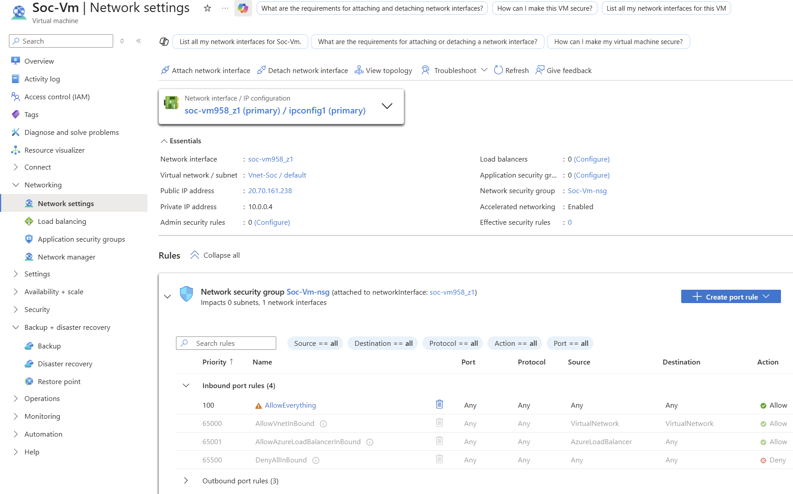

**Disabling Windows Security**

After RDPinto the VM using my host system's RDP function, I disabled Windows Defender Firewall for all profiles (Domain, Private, Public). 

### Phase 3: Setting Up Log Collection

**Creating Log Analytics Workspace**

I deployed a Log Analytics Workspace to serve as the centralized repository for all security logs. This workspace acts as the data layer that Microsoft Sentinel builds upon.

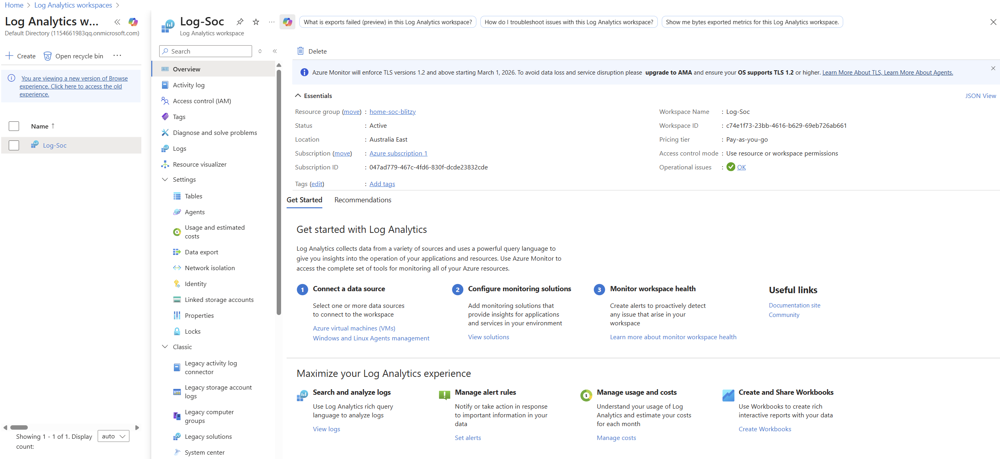

**Enabling Microsoft Sentinel**

I enabled Microsoft Sentinel on the log-soc workspace, which is a full SIEM platform with threat detection capabilities.

**Installing Security Events Connector**

From Sentinel's Content Hub, I installed the "Windows Security Events" solution, which provided queries specific to Windows security

**Configuring Data Collection**

I connected my honeypot VM to Sentinel using the "Windows Security Events via AMA" data connector from the Data Connectors tab in sentinel. This will:
- Install Azure Monitor Agent on the VM
- Create a Data Collection Rule (DCR-1) 
- Configure the rule to collect ALL security events
- Establish the data pipeline: VM → Agent → Log Analytics → Sentinel

### Phase 4: Verifying Attack Data

**Waiting for Attacks**

After 24-48 hours, internet scanners discovered my exposed RDP port. I started seeing Event ID 4625 (Failed Logon) events alongside with other events.

Using a simple KQL query to check for EventID 4625, I confirmed that attackers were actively trying common usernames like "administrator", "root", "server", "admin".

### Phase 5: Adding Geolocation Intelligence

**Creating the IP Geolocation Watchlist**

To map attacks to their geographic origins, I created a watchlist in Sentinel named "geoip". I uploaded a CSV file (available in configs folder) containing IP address ranges mapped to:
- Country name
- City name  
- Latitude and longitude coordinates
- Network ranges

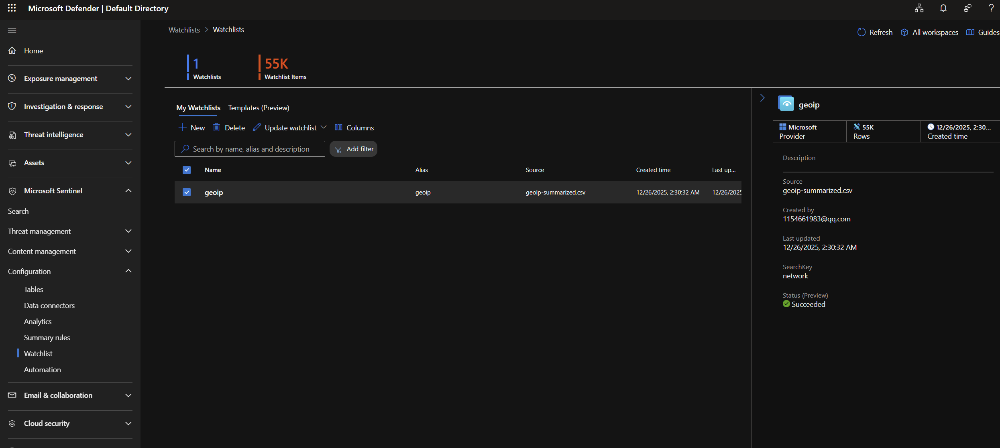

**Enriching Attack Data**

Using the `ipv4_lookup` function in KQL, I joined the failed login events with the geolocation data. This enrichment revealed that attacks were coming from many different countries.

The full KQL is available in config folder.

### Phase 6: Creating Automated Detection Rules

**Building the Analytic Rule**

I created a set of custom scheduled query rules in Sentinel - Configuration - Analytics that:
- Looks back at the last 1 hour of data
- Detects abnormal behaviour based on defined patterns
- Groups all detections into a single incident

The complete rule configuration is in the config folder.

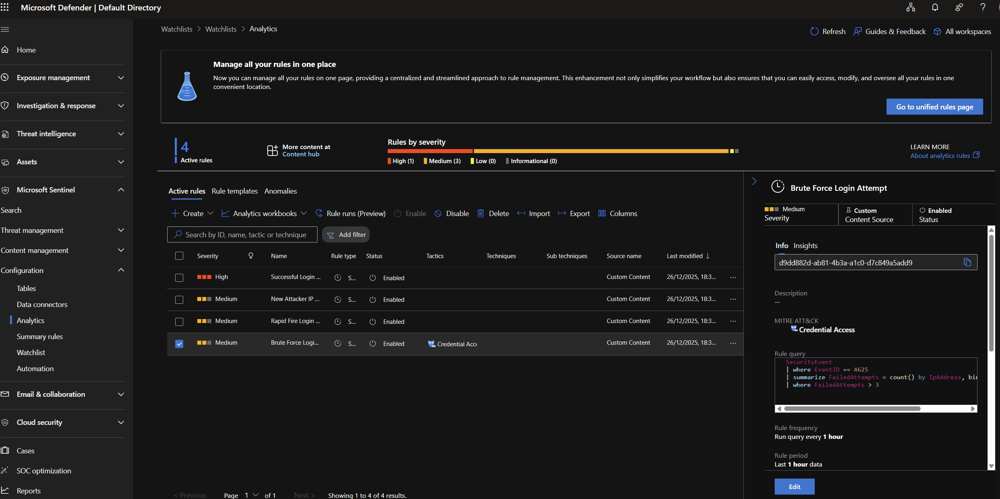

**Configuring Incident Settings**

I enabled incident creation from alerts with these settings:
- Create incidents: Enabled
- Alert grouping: Group all alerts into single incident  

After the first run, incidents started appearing automatically in the Sentinel Incidents dashboard.

### Phase 7: Building the Automation Workflow

**Creating the Logic App**

I deployed an Azure Logic App to enable automation of the workflow after an incident is created.

**Enabling Managed Identity**

To allow the Logic App to interact with Sentinel, I enabled the system-assigned managed identity. This creates a service principal that can be granted permissions without storing credentials.

**Assigning Permissions**

I navigated to the Log Analytics Workspace access control and assigned the "Microsoft Sentinel Responder" role to the Logic App's managed identity. This grants permission to:
- View incidents
- Add comments to incidents  
- Update incident properties
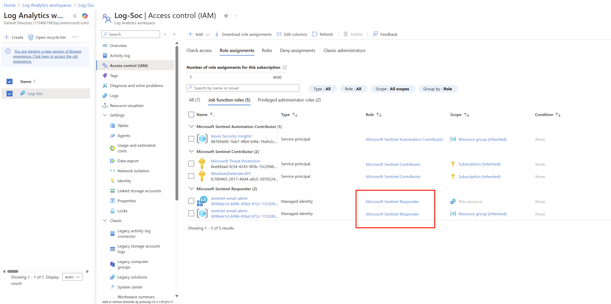

### Phase 8: Integrating AI-Powered Analysis

**Adding the Sentinel Trigger**

I configured the Logic App to trigger "When Azure Sentinel incident creation rule was triggered". This webhook-based trigger fires instantly when Sentinel creates a new incident.
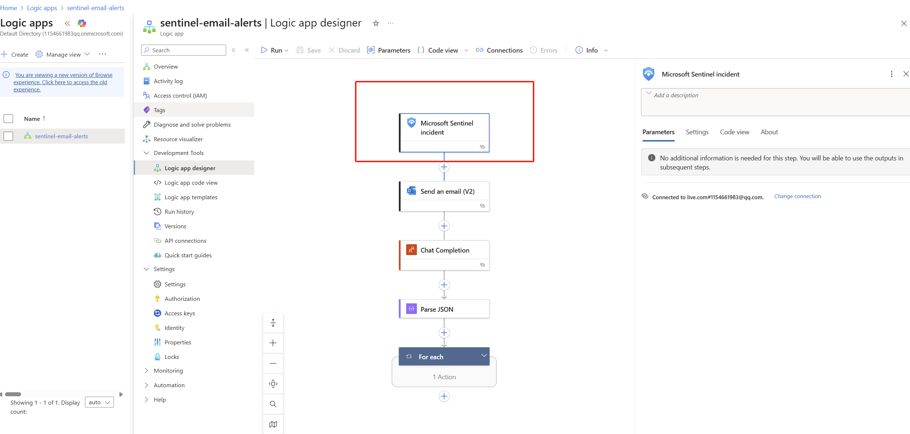

**Connecting to OpenAI**

I added a "Chat Completion" action and connected to the OpenAI API using my API key obtained from OpenAI. The action sends incident details to GPT4oTurbo with a structured prompt requesting:
- Threat assessment  
- Immediate recommended actions
- MITRE ATT&CK technique mapping
- Risk score (1-10)

The complete prompt template in code form is in the config folder.
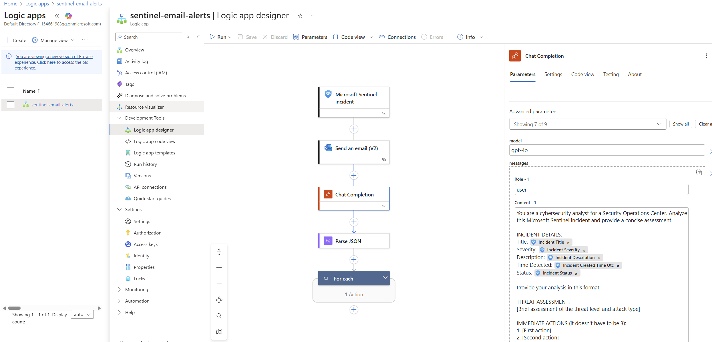

**Handling the AI Response**

I added a "Parse JSON" action to extract the AI's text response from the API's JSON structure. The schema for parsing is in the config folder.

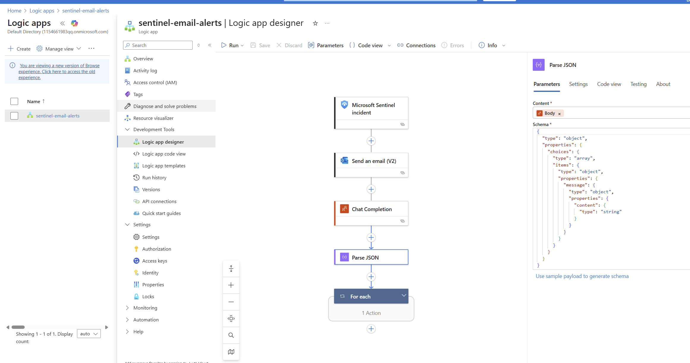

### Phase 9: Automating Incident Enrichment

**Adding Comments to Incidents**

I configured the "Add comment to incident (V3)" action to insert the AI analysis to the incident itself as a comment.  

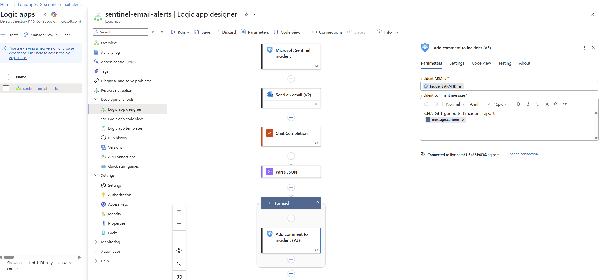

**Configuring Email Notifications**

I added an "Send an email (V2)" action using Office 365 Outlook to notify the hypothetical SOC team (which is really my own email). The email includes:
- Incident title and severity
- Time detected
- Link to the full incident in Sentinel

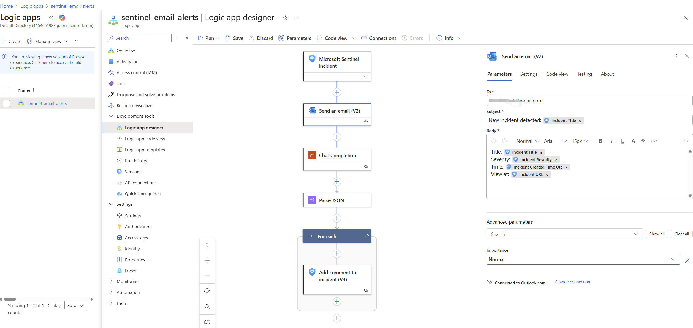

### Phase 10: Linking Automation to Sentinel

**Creating the Automation Rule**

In Sentinel, I created an automation rule named "Email Alert on Incident Creation" that:
- Triggers when any incident is created  
- Runs the "sentinel-email-alerts" playbook (Logic App)
- Has no expiration date
- Status: Enabled

This links the entire workflow together: Analytic Rule → Incident → Automation Rule → Logic App → AI Analysis + Email

**The Automated Workflow Result**

The designated email address receives incident alarm at a regular interval

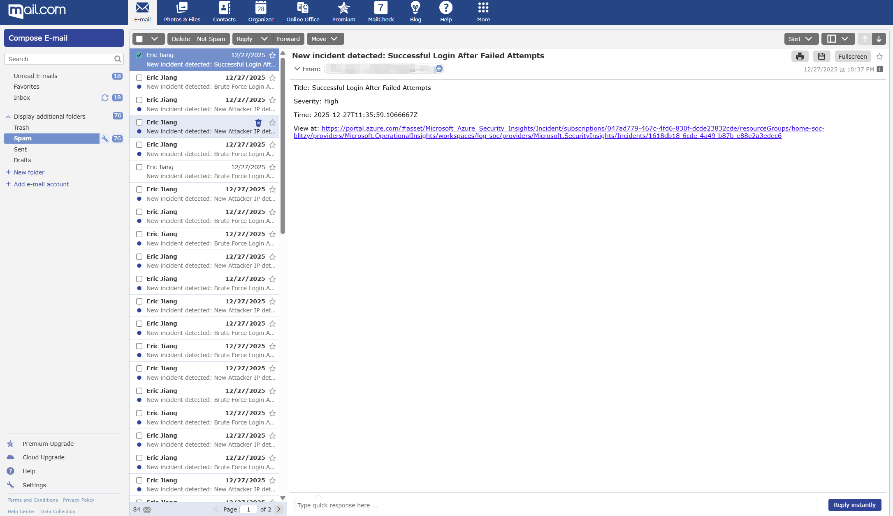

Clicking the link in the email, it will take you to the incident detail page, which contains other information alongside the ai generated comment

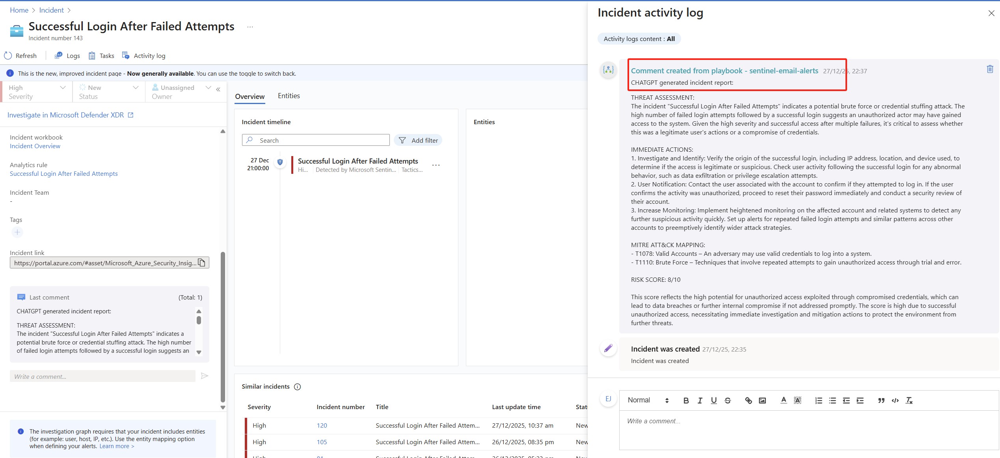

